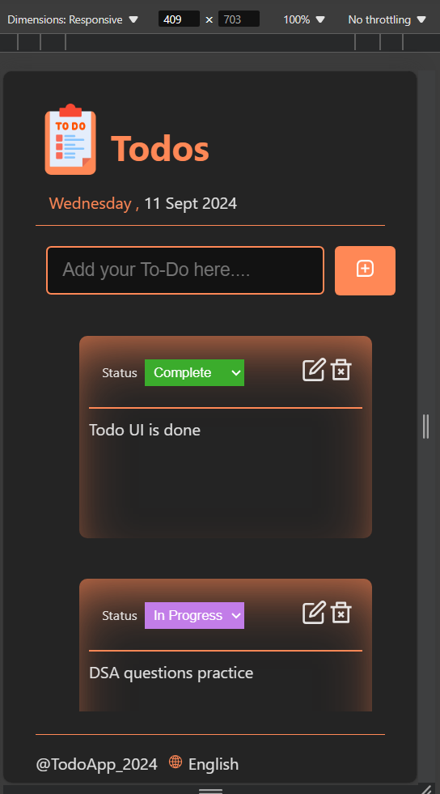

# Todo App - Telecrm

### Overview
This is a simple, responsive Todo application built with React. It allows users to add, edit, view, update the status, and remove tasks.

### [Deployed Link](https://todos-orpin-one.vercel.app/)

### Screenshots
<div align="center" style="display: flex; justify-content: center; gap: 10px;">
  
  
</div>


### Features
- **Add New Tasks**: Users can input a title and description to add tasks.
- **View Tasks**: Tasks are displayed in a list format.
- **Edit Tasks**: Users can edit the title and description of existing tasks.
- **Update Task Status**: Tasks can be marked as complete or incomplete.
- **Remove Tasks**: Tasks can be removed from the list.
- **Responsive Design**: The app is fully responsive and adapts to different screen sizes.

### Technologies Used
- React
- CSS for styling
- React-Icons

### Installation
```
npm i react-icon
```
#### Clone the Repository

```bash
git clone https://github.com/SurabhiMoond/todos_telecrm.git
cd todos_telecrm
```
